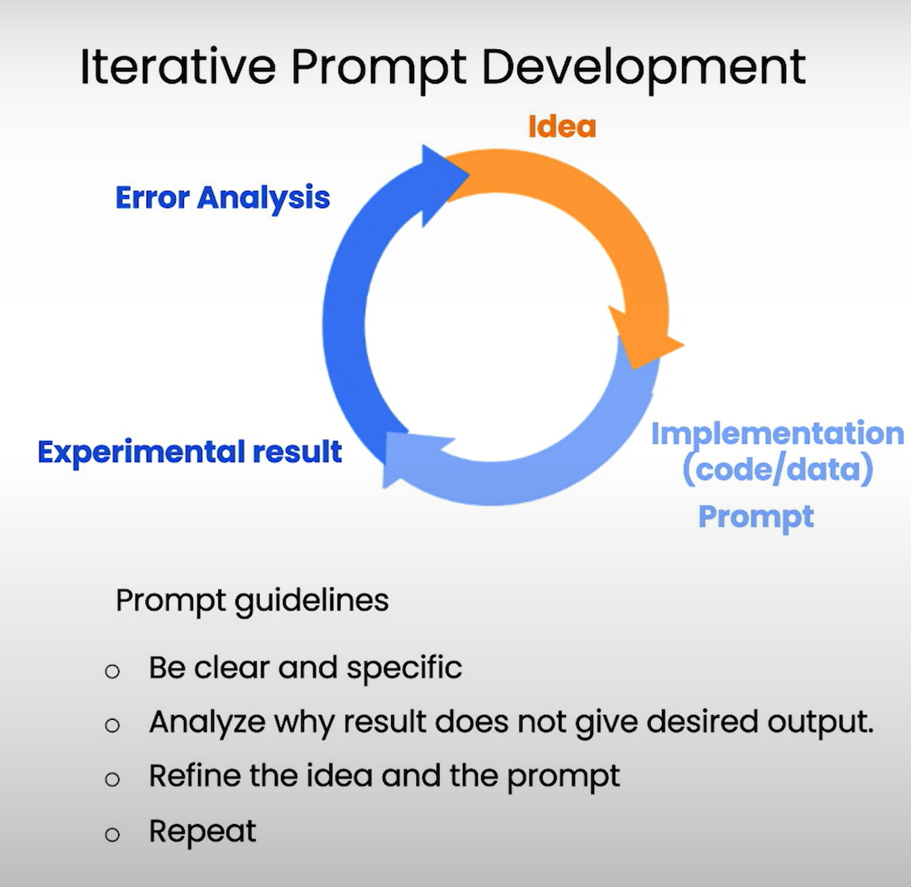

# Prompt Engineering

# Type of LLMs

## Base LLM

Predicts next word, based on text training data

ex-1
Once upon a time, there was a unicorn…..next part is response
that lived in a magical forest with
all her unicorn friends

ex-2
What is the capital of France?…..

….
What is France's largest city?
What is France's population?
What is the currency of France?

## Instruction Tuned LLM

- Tries to follow instructions
- Fine-tune on instructions and good attempts at following those instructions.
- RLHF: Reinforcement Learning with Human Feedback
- Helpful, Honest, Harmless

What is the capital of France?
ans: The capital of France is Paris.

```python
import google.generativeai as genai

# Configure API key
genai.configure(api_key="your_api_key")

# Create model instance
model = genai.GenerativeModel(model_name="models/gemini-2.5-flash-lite")

# Function to generate response
def get_completion(prompt):
    response = model.generate_content(prompt)
    return response.text

//for chat gpt api
def get_completion(prompt, model="gpt-3.5-turbo"):
    messages = [{"role": "user", "content": prompt}]
    response = openai.ChatCompletion.create(
        model=model,
        messages=messages,
        temperature=0, # this is the degree of randomness of the model's output
    )
    return response.choices[0].message["content"]
```

### Principle -1: Write clear and specific instructions
Tactic 1:

Use delimiters

- Triple quotes:
- Triple backticks:
- Triple dashes: ---,
- Angle brackets: <
- XML tags: <tag> </tag>

example prompt:

```python
text = f"""
You should express what you want a model to do by \ 
providing instructions that are as clear and \ 
specific as you can possibly make them. \ 
This will guide the model towards the desired output, \ 
and reduce the chances of receiving irrelevant \ 
or incorrect responses. Don't confuse writing a \ 
clear prompt with writing a short prompt. \ 
In many cases, longer prompts provide more clarity \ 
and context for the model, which can lead to \ 
more detailed and relevant outputs.
"""
prompt = f"""
Summarize the text delimited by triple backticks \ 
into a single sentence.
```{text}```
"""
response = get_completion(prompt)
print(response)
```

### Tactic 2:

Ask for structured output
HTML, JSON

```python
prompt = f"""
Generate a list of three made-up book titles along \ 
with their authors and genres. 
Provide them in JSON format with the following keys: 
book_id, title, author, genre.
"""
response = get_completion(prompt)
print(response)
```

### Tactic 3:

Check whether conditions are satisfied
Check assumptions required to do the task

```python
text_1 = f"""
Making a cup of tea is easy! First, you need to get some \ 
water boiling. While that's happening, \ 
grab a cup and put a tea bag in it. Once the water is \ 
hot enough, just pour it over the tea bag. \ 
Let it sit for a bit so the tea can steep. After a \ 
few minutes, take out the tea bag. If you \ 
like, you can add some sugar or milk to taste. \ 
And that's it! You've got yourself a delicious \ 
cup of tea to enjoy.
"""
prompt = f"""
You will be provided with text delimited by triple quotes. 
If it contains a sequence of instructions, \ 
re-write those instructions in the following format:

Step 1 - ...
Step 2 - …
…
Step N - …

If the text does not contain a sequence of instructions, \ 
then simply write \"No steps provided.\"

\"\"\"{text_1}\"\"\"
"""
response = get_completion(prompt)
print("Completion for Text 1:")
print(response)
```

### Tactic 4:

 Few-shot prompting
Give successful examples of completing tasks
Then ask model to perform the task

```python
prompt=f"""
Your task is to answer in a consistent style.

<child>: Teach me about patience.

<grandparent>: The river that carves the deepest \ 
valley flows from a modest spring; the \ 
grandest symphony originates from a single note; \ 
the most intricate tapestry begins with a solitary thread.

<child>: Teach me about resilience.
"""
response = get_completion(prompt)
print(response)
```

# Principle -2: Give the model time to think.

## Tactic 1:

Specify the steps to complete a task.
Step 1…
Step 2….

.

.
Step N….

ex:-

```python
text = f"""
In a charming village, siblings Jack and Jill set out on \ 
a quest to fetch water from a hilltop \ 
well. As they climbed, singing joyfully, misfortune \ 
struck—Jack tripped on a stone and tumbled \ 
down the hill, with Jill following suit. \ 
Though slightly battered, the pair returned home to \ 
comforting embraces. Despite the mishap, \ 
their adventurous spirits remained undimmed, and they \ 
continued exploring with delight.
"""
# example 1
prompt_1 = f"""
Perform the following actions: 
1 - Summarize the following text delimited by triple \
backticks with 1 sentence.
2 - Translate the summary into French.
3 - List each name in the French summary.
4 - Output a json object that contains the following \
keys: french_summary, num_names.

Separate your answers with line breaks.

Text:
```{text}```
"""
response = get_completion(prompt_1)
print("Completion for prompt 1:")
print(response)
```

or ex:-2

```python
prompt_2 = f"""
Your task is to perform the following actions: 
1 - Summarize the following text delimited by 
  <> with 1 sentence.
2 - Translate the summary into French.
3 - List each name in the French summary.
4 - Output a json object that contains the 
  following keys: french_summary, num_names.

Use the following format:
Text: <text to summarize>
Summary: <summary>
Translation: <summary translation>
Names: <list of names in summary>
Output JSON: <json with summary and num_names>

Text: <{text}>
"""
response = get_completion(prompt_2)
print("\nCompletion for prompt 2:")
print(response)
```

## Tactic-2:

Instruct the model to work out its own solution before rushing to a conclusion.

### wrong example

```python
prompt = f"""
Determine if the student's solution is correct or not.

Question:
I'm building a solar power installation and I need \
 help working out the financials. 
- Land costs $100 / square foot
- I can buy solar panels for $250 / square foot
- I negotiated a contract for maintenance that will cost \ 
me a flat $100k per year, and an additional $10 / square \
foot
What is the total cost for the first year of operations 
as a function of the number of square feet.

Student's Solution:
Let x be the size of the installation in square feet.
Costs:
1. Land cost: 100x
2. Solar panel cost: 250x
3. Maintenance cost: 100,000 + 100x
Total cost: 100x + 250x + 100,000 + 100x = 450x + 100,000
"""
response = get_completion(prompt)
print(response)
```

### correct example

```python
prompt = f"""
Your task is to determine if the student's solution \
is correct or not.
To solve the problem do the following:
- First, work out your own solution to the problem including the final total. 
- Then compare your solution to the student's solution \ 
and evaluate if the student's solution is correct or not. 
Don't decide if the student's solution is correct until 
you have done the problem yourself.

Use the following format:
Question:
```
question here
```
Student's solution:
```
student's solution here
```
Actual solution:
```
steps to work out the solution and your solution here
```
Is the student's solution the same as actual solution \
just calculated:
```
yes or no
```
Student grade:
```
correct or incorrect
```

Question:
```
I'm building a solar power installation and I need help \
working out the financials. 
- Land costs $100 / square foot
- I can buy solar panels for $250 / square foot
- I negotiated a contract for maintenance that will cost \
me a flat $100k per year, and an additional $10 / square \
foot
What is the total cost for the first year of operations \
as a function of the number of square feet.
``` 
Student's solution:
```
Let x be the size of the installation in square feet.
Costs:
1. Land cost: 100x
2. Solar panel cost: 250x
3. Maintenance cost: 100,000 + 100x
Total cost: 100x + 250x + 100,000 + 100x = 450x + 100,000
```
Actual solution:
"""
response = get_completion(prompt)
print(response)
```

# Model Limitations

## 1.Hallucination:

    Makes statements that sound plausible but are not true.(make things up)

 cause: the model is trained upon a vast amount of data but its not accurately stored its all of its    data and it does not knows the boundaries of its knowledge very well

ex:-

```python
prompt = f"""
Tell me about AeroGlide UltraSlim Smart Toothbrush by Boie
"""
response = get_completion(prompt)
print(response)
```

## Reducing hallucinations:

First find relevant information,
then answer the question
based on the relevant information.

# Iterative prompt development process.



```python
fact_sheet_chair = """
OVERVIEW
- Part of a beautiful family of mid-century inspired office furniture, 
including filing cabinets, desks, bookcases, meeting tables, and more.
- Several options of shell color and base finishes.
- Available with plastic back and front upholstery (SWC-100) 
or full upholstery (SWC-110) in 10 fabric and 6 leather options.
- Base finish options are: stainless steel, matte black, 
gloss white, or chrome.
- Chair is available with or without armrests.
- Suitable for home or business settings.
- Qualified for contract use.

CONSTRUCTION
- 5-wheel plastic coated aluminum base.
- Pneumatic chair adjust for easy raise/lower action.

DIMENSIONS
- WIDTH 53 CM | 20.87”
- DEPTH 51 CM | 20.08”
- HEIGHT 80 CM | 31.50”
- SEAT HEIGHT 44 CM | 17.32”
- SEAT DEPTH 41 CM | 16.14”

OPTIONS
- Soft or hard-floor caster options.
- Two choices of seat foam densities: 
 medium (1.8 lb/ft3) or high (2.8 lb/ft3)
- Armless or 8 position PU armrests 

MATERIALS
SHELL BASE GLIDER
- Cast Aluminum with modified nylon PA6/PA66 coating.
- Shell thickness: 10 mm.
SEAT
- HD36 foam

COUNTRY OF ORIGIN
- Italy
"""
```

now the prompt 

1.First attempt.

```python
prompt = f"""
Your task is to help a marketing team create a 
description for a retail website of a product based 
on a technical fact sheet.

Write a product description based on the information 
provided in the technical specifications delimited by 
triple backticks.

Technical specifications: ```{fact_sheet_chair}```
"""
response = get_completion(prompt)
print(response)

```

here is the answer

```markdown
## Elevate Your Workspace with Mid-Century Modern Style and Uncompromising Comfort

**Bring timeless design and exceptional quality to your home or office with this exquisitely crafted office chair.** Inspired by the elegant simplicity of mid-century modern aesthetics, this chair is a standout piece that seamlessly integrates into a broader collection of stylish office furniture, including filing cabinets, desks, bookcases, and meeting tables.

**Personalize your space with a spectrum of sophisticated choices.** Select from a range of captivating shell colors and complement your decor with your preferred base finish. Choose between the sleek **plastic back and front upholstery (SWC-100)** or the sumptuously comfortable **full upholstery (SWC-110)**, available in your choice of 10 luxurious fabric or 6 rich leather options. The robust base is offered in striking **stainless steel, matte black, glossy white, or polished chrome**, ensuring a perfect match for any environment. Further tailor your comfort and style with the option of **armless design or 8-position adjustable PU armrests**.

**Engineered for durability and effortless adjustability.** The chair features a stable, **plastic-coated aluminum 5-wheel base** for smooth mobility across any floor surface, with your choice of **soft or hard-floor casters**. Experience effortless height adjustment with the reliable **pneumatic chair lift**. Inside, you'll find high-density **HD36 foam** for superior seating comfort, with two foam density options – **medium (1.8 lb/ft3)** or **high (2.8 lb/ft3)** – allowing you to customize your seating experience. The robust shell, crafted from **cast aluminum with a durable modified nylon coating**, boasts a substantial 10mm thickness for lasting quality.

**Designed for both style and function, this chair is not only perfect for creating an inviting home office but is also qualified for demanding contract use in professional settings.**

**Dimensions:**
*   Width: 53 CM | 20.87”
*   Depth: 51 CM | 20.08”
*   Height: 80 CM | 31.50”
*   Seat Height: 44 CM | 17.32”
*   Seat Depth: 41 CM | 16.14”

**Proudly Made in Italy.**
```

note : not too good and kind of long (not satisfactory)

2.Example-2

```python
prompt = f"""
Your task is to help a marketing team create a 
description for a retail website of a product based 
on a technical fact sheet.

Write a product description based on the information 
provided in the technical specifications delimited by 
triple backticks.

Use at most 50 words.
Technical specifications: ```{fact_sheet_chair}```
"""
response = get_completion(prompt)
print(response)
```

3.Example -3:

```python
prompt = f"""
Your task is to help a marketing team create a 
description for a retail website of a product based 
on a technical fact sheet.

Write a product description based on the information 
provided in the technical specifications delimited by 
triple backticks.

The description is intended for furniture retailers, 
so should be technical in nature and focus on the 
materials the product is constructed from.

Use at most 50 words.

Technical specifications: ```{fact_sheet_chair}```
"""
response = get_completion(prompt)
print(response)
```

4.Example-4:

```python
prompt = f"""
Your task is to help a marketing team create a 
description for a retail website of a product based 
on a technical fact sheet.

Write a product description based on the information 
provided in the technical specifications delimited by 
triple backticks.

The description is intended for furniture retailers, 
so should be technical in nature and focus on the 
materials the product is constructed from.

At the end of the description, include every 7-character 
Product ID in the technical specification.

Use at most 50 words.

Technical specifications: ```{fact_sheet_chair}```
"""
response = get_completion(prompt)
print(response)
```

5.Example-5:

```python
prompt = f"""
Your task is to help a marketing team create a 
description for a retail website of a product based 
on a technical fact sheet.

Write a product description based on the information 
provided in the technical specifications delimited by 
triple backticks.

The description is intended for furniture retailers, 
so should be technical in nature and focus on the 
materials the product is constructed from.

At the end of the description, include every 7-character 
Product ID in the technical specification.

After the description, include a table that gives the 
product's dimensions. The table should have two columns.
In the first column include the name of the dimension. 
In the second column include the measurements in inches only.

Give the table the title 'Product Dimensions'.

Format everything as HTML that can be used in a website. 
Place the description in a <div> element.

Technical specifications: ```{fact_sheet_chair}```
"""

response = get_completion(prompt)
print(response)
```

## In Summary

- Try something
- Analyze where the result does not give what you want
- Clarify instructions ,give more time to think.
- Refine prompts with a batch of examples.